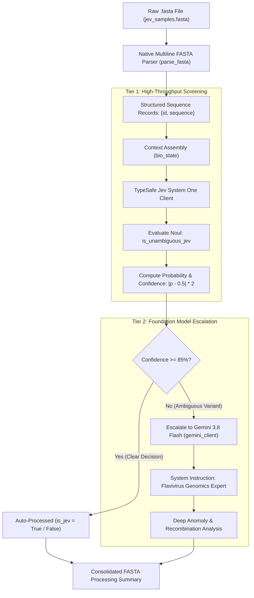

 # General Viral Gene Annotator — Documentation

This document explains the technical architecture, classification mechanisms, and biological rationale behind the **General Viral Gene Annotator** pipeline in [`jev sequence alignment.py`](jev%20sequence%20alignment.py).

> **Note on naming:** The pipeline was originally developed for Japanese Encephalitis Virus (JEV) triage, and the JEV example is fully retained. It has since been generalised to annotate genes from any of five viral pathogens (JEV, SARS-CoV-2, H5N1, Poliovirus, HIV) and is now named the **General Viral Gene Annotator**.

---

## 1. Executive Summary: Does This Pipeline Access NCBI?

**No.** The General Viral Gene Annotator does **not** connect to the National Center for Biotechnology Information (NCBI) Entrez API, NCBI BLAST, GenBank, or any remote bioinformatics sequence database.

Instead, the pipeline relies on **parametric neural network knowledge** via a two-tiered AI architecture:
1. **Tier 1 (High-Throughput Screening):** TypeSafe AI's System One probabilistic decision model.
2. **Tier 2 (Expert Escalation):** Google's Gemini 3.8 Flash foundation model acting as a specialized viral genomics reasoning engine.

---

## 2. Pipeline Architecture & Workflow



---


---

## 2.1 Native Sequence Alignment Engine (`compute_kmer_alignment`)

To accurately classify query sequences regardless of whether FASTA headers are blind, synthetic (e.g. `>tralalalalalaallaalal`), or unannotated, the pipeline incorporates a lightweight, pure-Python k-mer sequence alignment engine that benchmarks incoming sequences against local reference genes:

* `HIV-gag-pol-gene.fna` (Human Immunodeficiency Virus 1)
* `sars-cov-2-orf1ab-gene.fna` (SARS-CoV-2)
* `H5N1-NA-gene.fna` (Influenza A H5N1)
* `Polio-PVgp1-gene.fna` (Poliovirus)
* `jev-gp2-gene.fa` (Japanese Encephalitis Virus)

The computed alignment profile is integrated into `bio_state`, allowing TypeSafe's System One model to make decisive, biologically grounded classifications even on blind query files.

## 3. Tier 1: How TypeSafe "Jev" Model Classifies Sequences

### 3.1 What is TypeSafe AI and the "Jev" Model?
TypeSafe AI provides "System One" decision models. Derived from Daniel Kahneman's cognitive psychology framework (*Thinking, Fast and Slow*), a System One model does not generate conversational prose. Instead, it performs fast, structured, probabilistic classification directly into software-defined schemas.

> [!NOTE]
> The model name **"Jev"** is TypeSafe's proprietary model release name. In this pipeline, it is used to evaluate sequences of **Japanese Encephalitis Virus (JEV)**.

### 3.2 The Multiplex `Choice` Screening Panel
The pipeline evaluates sequences against a multi-viral pathogen panel using TypeSafe's `Choice` primitive:
```python
questions={
    "viral_classification": Choice(
        instructions="Identify which viral pathogen this genomic sequence belongs to:",
        criteria={
            "jev": "Japanese Encephalitis Virus (Flaviviridae)",
            "sars_cov_2": "SARS-CoV-2 Coronavirus (Coronaviridae)",
            "influenza_h5n1": "Influenza A virus subtype H5N1 (Orthomyxoviridae)",
            "poliovirus": "Poliovirus (Picornaviridae)",
            "hiv": "Human Immunodeficiency Virus (Retroviridae)",
            "none": "None of the above / Non-viral / Synthetic artifact"
        }
    )
}
```
The model evaluates the sequence across all 5 target pathogens simultaneously, returning the top matched pathogen, a confidence score, and a full probability distribution across all candidates.

### 3.3 Confidence Scoring Formula
To measure how decisive the model is, the pipeline computes:
$$\text{Confidence} = |p - 0.5| \times 2$$

* If $p = 0.5$ (maximum uncertainty / 50-50 guess), $\text{Confidence} = 0.0$ (0%).
* If $p = 1.0$ (certainly JEV), $\text{Confidence} = 1.0$ (100%).
* If $p = 0.0$ (certainly NOT JEV), $\text{Confidence} = 1.0$ (100%).

### 3.4 Why the Test Samples Were Auto-Processed at ~94% Confidence
When running [`jev_samples.fasta`](jev_samples.fasta):
* **`SAMPLE_01_AUST_GIII`**: `ATGCGACGTACGTAC...` (Artificial 4-mer tandem repeat: `(CGTA)n`).
* **`SAMPLE_02_AMBIGUOUS_RECOMBINANT`**: `ATGGGGAAAGGGAAA...` (Artificial 6-mer tandem repeat: `(GGGAAA)n`).

Because genuine JEV is an **~11 kb single-stranded positive-sense RNA Flavivirus** with complex polyprotein coding sequences (Capsid, prM, Envelope, NS1–NS5), these short synthetic repeat strings lack biological sequence complexity, open reading frames, and nucleotide patterns typical of flaviviruses.

The model returned $p \approx 0.03$ (a 3% chance of being JEV):
$$\text{Confidence} = |0.03 - 0.5| \times 2 = 0.47 \times 2 = 94.0\%$$
$$\text{is\_jev} = (0.03 \ge 0.5) \rightarrow \mathbf{False}$$

The model was **94% confident in rejecting the sequences**, fulfilling the $\ge 85\%$ threshold for automated processing without needing LLM escalation.

---

## 4. Tier 2: How Gemini 3.8 Flash Handles Ambiguous Sequences

When a sequence falls into the uncertain zone ($\text{Confidence} < 85\%$, or $0.425 < p < 0.575$), the pipeline automatically triggers **Gemini 3.8 Flash**.

### 4.1 System Persona and Role Definition
Gemini is initialized with domain-specific grounding:
```python
config = types.GenerateContentConfig(
    system_instruction="You are an advanced viral genomics expert specializing in Flaviviruses.",
    max_output_tokens=1500,
)
```

### 4.2 LLM Reasoning Mechanisms
Gemini analyzes the sequence across multiple genomic dimensions:
1. **Flavivirus Homology & Conserved Motifs:** Evaluates structural genes (E protein fusion loop, receptor-binding domain) or non-structural catalytic triads (NS3 protease, NS5 RNA-dependent RNA polymerase).
2. **Recombination Detection:** Identifies chimeric breakpoints between related flaviviruses (e.g., JEV, West Nile Virus, St. Louis Encephalitis Virus, Dengue Virus).
3. **Sequencing Artifacts vs. True Variants:** Distinguishes PCR primer dimers, adapter contamination, and homopolymer sequencing errors from biological single nucleotide variants (SNVs).

---

## 5. Comparative Analysis: AI Pipeline vs. Standard NCBI Bioinformatics

| Feature | Standard NCBI Approach (e.g. BLASTn) | This AI Pipeline (`jev sequence alignment.py`) |
| :--- | :--- | :--- |
| **Detection Method** | Deterministic local alignment (Smith-Waterman / BLAST seed-and-extend) | Neural pattern recognition and probabilistic schema evaluation |
| **Reference Database** | NCBI RefSeq Viral (`NC_001437.1`), GenBank `nt` / `nr` | Pre-trained model weights learned from scientific and genomic corpora |
| **Reported Metrics** | E-value, bit score, % nucleotide identity, alignment length | Probability score ($p$) and decision confidence ($|p - 0.5| \times 2$) |
| **External Dependencies** | NCBI Entrez API / local BLAST+ database (~50 GB) | Lightweight APIs (`typesafe-sdk`, `google-genai`) |
| **Latency / Throughput** | Seconds to minutes per query (queue or disk I/O) | Milliseconds for Tier 1 screening; highly concurrent via `asyncio` |
| **Biological Granularity** | Base-by-base mismatch and indel coordinates | Categorical decision routing + natural language synthesis |

---

## 6. How to Add Deterministic NCBI Verification (Future Enhancement)

If deterministic alignment against curated NCBI accessions is required, the pipeline can be extended with a hybrid verification step using Biopython or the NCBI Entrez REST API:

```python
from Bio.Blast import NCBIWWW, NCBIXML

def verify_with_ncbi(sequence: str) -> dict:
    """Performs a remote BLASTn query against NCBI RefSeq viruses."""
    result_handle = NCBIWWW.qblast("blastn", "ref_viruses_repgenomes", sequence, entrez_query="txid11072[Organism]")
    blast_record = NCBIXML.read(result_handle)
    if blast_record.alignments:
        top_hit = blast_record.alignments[0]
        top_hsp = top_hit.hsps[0]
        return {
            "ncbi_hit": top_hit.title,
            "e_value": top_hsp.expect,
            "identity_pct": (top_hsp.identities / top_hsp.align_length) * 100
        }
    return {"ncbi_hit": None, "e_value": None, "identity_pct": 0.0}
```

---

## 7. Wet Laboratory & Clinical Validation Disclaimer

> [!CAUTION]
> **EXPERIMENTAL PROTOTYPE — NOT FOR DIRECT WET LAB OR CLINICAL USE**
> 
> The predictions, classifications, and confidence scores generated by this pipeline **must not be taken for granted** as validated biological facts in a wet laboratory or clinical diagnostic setting.
>
> This pipeline represents an **experimental proof-of-concept** exploring the capabilities of TypeSafe's nascent "Jev" System One decision model and Gemini LLM routing on genomic sequence data. It is subject to the following critical limitations:
> 
> 1. **No Base-Level Alignment:** Unlike alignment tools, parametric models do not provide base-by-base mismatch tracking, indel penalty scoring, or statistical E-values.
> 2. **Risk of Hallucination or Heuristic Bias:** Language and probabilistic decision models can exhibit unexpected biases or misclassifications when presented with atypical chimeric sequences, novel recombinants, or degraded PCR reads.
> 3. **Absence of Empirical Wet-Lab Calibration:** The confidence thresholds (e.g., $85\%$) are computational heuristics and have not been benchmarked against wet-lab diagnostic standards (such as RT-qPCR, plaque reduction neutralization tests [PRNT], or Sanger sequencing confirmation).

### Recommended Protocol for Wet Lab Validation

For any downstream wet laboratory validation, experimental synthesis, assay design, or clinical reporting, researchers **must use well-established, peer-reviewed, and standardized bioinformatics pipelines**:

* **Sequence Identity & Database Validation:** Use **NCBI BLAST** (`blastn` / `blastx`) against the non-redundant nucleotide (`nt`) and curated RefSeq viral databases (e.g., JEV reference strain [NC_001437.1](https://www.ncbi.nlm.nih.gov/nuccore/NC_001437.1)).
* **Read Mapping & Coverage Depth:** Use established short- and long-read mappers such as **Bowtie2**, **BWA-MEM**, or **Minimap2** with quality filtering via SAMtools.
* **Variant Calling & Recombination Screening:** Employ established viral typing tools like **Genome Detective Flavivirus Typing Tool**, **VIPR**, or **SimPlot / RDP5** for genuine recombination analysis.
* **Wet-Lab Confirmation:** Validate in vitro via CDC/WHO-recommended JEV-specific **reverse transcription real-time PCR (RT-qPCR)**, specific envelope protein antibody ELISA, or targeted amplicon deep sequencing.

---

## 8. Codebase Overview

### 8.1 About This Project

The **General Viral Gene Annotator** is an asynchronous, two-tiered AI-driven pipeline that classifies raw FASTA genomic sequences against a panel of five high-priority viral pathogens. Although it originated as a Japanese Encephalitis Virus (JEV) triage tool — and the JEV example is fully retained — the annotator is designed to handle any gene from the following viruses:

| Pathogen | Family | Reference Gene Used | Example Input File |
| :--- | :--- | :--- |
| Japanese Encephalitis Virus (JEV) ⭐ | Flaviviridae | gp2 polyprotein gene | `jev-gp2-gene.fa` / `jev_samples.fasta` |
| SARS-CoV-2 | Coronaviridae | ORF1ab gene | `sars-cov-2-orf1ab-gene.fna` |
| Influenza A H5N1 | Orthomyxoviridae | Neuraminidase (NA) gene | `H5N1-NA-gene.fna` |
| Poliovirus | Picornaviridae | PVgp1 gene | `Polio-PVgp1-gene.fna` |
| Human Immunodeficiency Virus (HIV) | Retroviridae | gag-pol gene | `HIV-gag-pol-gene.fna` |

> ⭐ JEV is the founding example and is retained in full as the primary demonstration use-case.

The annotator uses a **native FASTA parser** (no external bioinformatics libraries such as Biopython required), a **local k-mer alignment engine** for sequence similarity scoring against reference genomes, and a **two-tiered AI decision system** combining TypeSafe's System One probabilistic model with Google Gemini 3.8 Flash for escalation.

### 8.2 Repository Structure

> **Primary script:** `jev sequence alignment.py` — this is the General Viral Gene Annotator entry point.

```
jev-bioinformatics/
├── jev sequence alignment.py        # Main pipeline script
├── README.md                        # This documentation (pipeline architecture)
│
├── gene.fasta                       # Default active query FASTA file
├── jev_samples.fasta                # Sample JEV test sequences
├── jev-gp2-gene.fa                  # JEV gp2 reference gene
├── HIV-gag-pol-gene.fna             # HIV gag-pol reference gene
├── sars-cov-2-orf1ab-gene.fna       # SARS-CoV-2 ORF1ab reference gene
├── Polio-PVgp1-gene.fna             # Poliovirus PVgp1 reference gene
├── H5N1-NA-gene.fna                 # Influenza H5N1 NA reference gene
│
└── Virus Data Set/                  # Reference genome datasets
    ├── JEVgp2_datasets/             # JEV reference sequences
    ├── ORF1ab_datasets/             # SARS-CoV-2 reference sequences
    ├── gag-pol_datasets/            # HIV reference sequences
    ├── NA_datasets/                 # H5N1 reference sequences
    └── PVgp1_datasets/             # Poliovirus reference sequences
```

---

## 9. Installation & Setup

### 9.1 Prerequisites

- **Python 3.10+** (tested on Python 3.12)
- **pip** (Python package manager)
- Active internet connection (for API calls to TypeSafe and Gemini)

### 9.2 Install Python Dependencies

```bash
pip install google-genai typesafe-sdk httpx
```

| Package | Purpose |
| :--- | :--- |
| `google-genai` | Google Gemini API client (Tier 2 escalation path) |
| `typesafe-sdk` | TypeSafe System One probabilistic decision model (Tier 1 screening) |
| `httpx` | High-performance async HTTP client (used internally) |

> [!NOTE]
> No external bioinformatics libraries (e.g., Biopython, pysam) are required. The FASTA parsing and k-mer alignment are implemented natively in the script.

### 9.3 API Keys Configuration

This pipeline requires **two API keys**:

#### 1. TypeSafe API Key (Required — Tier 1 Screening)

The TypeSafe API key is used for the System One probabilistic viral classification model. Obtain your key from [TypeSafe](https://typesafe.ai) and set it directly in the script or as an environment variable:

**Option A — Hardcoded in script (current default):**
```python
typesafe_client = AsyncTypeSafeClient(
    api_key="YOUR_TYPESAFE_API_KEY"
)
```

**Option B — Environment variable (recommended for production):**
```bash
export TYPESAFE_API_KEY="your_typesafe_api_key_here"
```
Then update the script:
```python
typesafe_client = AsyncTypeSafeClient(
    api_key=os.getenv("TYPESAFE_API_KEY")
)
```

#### 2. Gemini API Key (Required — Tier 2 Escalation)

The Gemini API key powers the escalation path for ambiguous sequences. Obtain your key from [Google AI Studio](https://aistudio.google.com/apikey).

**Option A — Environment variable (recommended):**
```bash
export GEMINI_API_KEY="your_gemini_api_key_here"
```
The `genai.Client()` constructor automatically reads `GEMINI_API_KEY` or `GOOGLE_API_KEY` from the environment.

**Option B — Hardcoded in script:**
```python
gemini_client = genai.Client(api_key="YOUR_GEMINI_API_KEY")
```

> [!IMPORTANT]
> Both API keys are **required** for full pipeline functionality. Without the TypeSafe key, Tier 1 screening will fail entirely. Without the Gemini key, only Tier 1 results will be returned, and ambiguous sequences will fall back to the alignment-only classification.

---

## 10. Usage Guide

### 10.1 Basic Usage

1. Place your query FASTA file in the project directory (or update the `fasta_file` variable in `main()`).

2. Edit line 181 of `jev sequence alignment.py` to point to your target file:
   ```python
   fasta_file = "gene.fasta"  # Change this to your FASTA filename
   ```

3. Run the pipeline:
   ```bash
   python3 "jev sequence alignment.py"
   ```

### 10.2 Example Output

```
Loaded 1 sequence(s) from raw FASTA file (HIV-gag-pol-gene.fna).
Loaded 5 viral reference genome(s): JEV, SARS_COV_2, INFLUENZA_H5N1, POLIOVIRUS, HIV

=== General Viral Gene Annotator — Sequence Classification Summary ===
Record: NP_057849.4                       | Action: Auto-Processed | Top Hit: HIV          | Confidence: 97.2%
   ├─ Reference Alignment Match: JEV: 2.1%, SARS_COV_2: 1.8%, INFLUENZA_H5N1: 0.9%, POLIOVIRUS: 1.2%, HIV: 68.4%
   └─ TypeSafe Viral Classification Probabilities: jev: 1.4%, sars_cov_2: 0.3%, influenza_h5n1: 0.1%, poliovirus: 0.2%, hiv: 97.8%, none: 0.2%
```

### 10.3 Switching Query Files

The script includes pre-configured file paths for all five reference pathogens. Uncomment the desired line in the `main()` function:

```python
# fasta_file = "jev_samples.fasta"       # JEV test samples
# fasta_file = "HIV-gag-pol-gene.fna"    # HIV gag-pol gene
# fasta_file = "sars-cov-2-orf1ab-gene.fna"  # SARS-CoV-2 ORF1ab gene
# fasta_file = "Polio-PVgp1-gene.fna"    # Poliovirus PVgp1 gene
# fasta_file = "H5N1-NA-gene.fna"        # Influenza H5N1 NA gene
# fasta_file = "jev-gp2-gene.fa"         # JEV gp2 gene
fasta_file = "gene.fasta"               # Default active file
```

### 10.4 Using Your Own FASTA Sequences

Place any standard FASTA file (`.fasta`, `.fna`, `.fa`) in the project directory and update the `fasta_file` variable. The parser supports:
- Single-sequence and multi-sequence FASTA files
- Multiline sequence data (sequences split across multiple lines)
- Standard FASTA header lines starting with `>`

---

## 11. Swapping the Escalation LLM Provider

The current pipeline uses **Google Gemini 3.8 Flash** as the Tier 2 escalation model. However, users can replace this with any other LLM provider of their choice. The escalation logic is isolated in the `triage_fasta_record()` function (lines ~139–158).

### 11.1 Supported Alternative LLMs

| LLM Provider | Python SDK | Model Example | Installation |
| :--- | :--- | :--- | :--- |
| **Google Gemini** (current) | `google-genai` | `gemini-3.8-flash` | `pip install google-genai` |
| **Anthropic Claude** | `anthropic` | `claude-sonnet-4-20250514` | `pip install anthropic` |
| **OpenAI ChatGPT** | `openai` | `gpt-4o` | `pip install openai` |
| **xAI Grok** | `openai` (compatible) | `grok-3` | `pip install openai` |

### 11.2 How to Swap: Claude Example

Replace the Gemini escalation block (lines ~142–158) with:

```python
# Replace google-genai imports with:
from anthropic import AsyncAnthropic

# Initialize Claude client (reads ANTHROPIC_API_KEY from environment)
claude_client = AsyncAnthropic()

# In triage_fasta_record(), replace the Gemini call with:
try:
    heavy_response = await claude_client.messages.create(
        model="claude-sonnet-4-20250514",
        max_tokens=1500,
        system="You are an advanced viral genomics expert specializing in human and zoonotic viral pathogens.",
        messages=[{
            "role": "user",
            "content": f"Analyze this sequence variant against target viral pathogens for potential homology, recombination, or anomalies:\n{bio_state}"
        }]
    )
    analysis_text = heavy_response.content[0].text
    escalation_status = "Escalated to Claude"
except Exception as claude_err:
    analysis_text = f"Claude escalation unavailable ({claude_err})."
    escalation_status = "Tier 1 Fallback (Claude Unreachable)"
```

### 11.3 How to Swap: OpenAI ChatGPT Example

```python
from openai import AsyncOpenAI

openai_client = AsyncOpenAI()  # Reads OPENAI_API_KEY from environment

# In triage_fasta_record():
try:
    heavy_response = await openai_client.chat.completions.create(
        model="gpt-4o",
        max_tokens=1500,
        messages=[
            {"role": "system", "content": "You are an advanced viral genomics expert specializing in human and zoonotic viral pathogens."},
            {"role": "user", "content": f"Analyze this sequence variant against target viral pathogens for potential homology, recombination, or anomalies:\n{bio_state}"}
        ]
    )
    analysis_text = heavy_response.choices[0].message.content
    escalation_status = "Escalated to ChatGPT"
except Exception as openai_err:
    analysis_text = f"ChatGPT escalation unavailable ({openai_err})."
    escalation_status = "Tier 1 Fallback (ChatGPT Unreachable)"
```

### 11.4 How to Swap: xAI Grok Example

Grok uses an OpenAI-compatible API endpoint:

```python
from openai import AsyncOpenAI

grok_client = AsyncOpenAI(
    api_key=os.getenv("XAI_API_KEY"),
    base_url="https://api.x.ai/v1"
)

# In triage_fasta_record():
try:
    heavy_response = await grok_client.chat.completions.create(
        model="grok-3",
        max_tokens=1500,
        messages=[
            {"role": "system", "content": "You are an advanced viral genomics expert specializing in human and zoonotic viral pathogens."},
            {"role": "user", "content": f"Analyze this sequence variant against target viral pathogens for potential homology, recombination, or anomalies:\n{bio_state}"}
        ]
    )
    analysis_text = heavy_response.choices[0].message.content
    escalation_status = "Escalated to Grok"
except Exception as grok_err:
    analysis_text = f"Grok escalation unavailable ({grok_err})."
    escalation_status = "Tier 1 Fallback (Grok Unreachable)"
```

> [!TIP]
> Regardless of which LLM you choose for the escalation path, the **Tier 1 TypeSafe System One screening is always required** and cannot be swapped. TypeSafe provides the structured probabilistic classification framework (via `Choice` primitives) that drives the initial triage decision. The LLM escalation path is only invoked for ambiguous sequences that fall below the confidence threshold.

> [!NOTE]
> When swapping LLM providers, remember to:
> 1. Update the `import` statements at the top of the script.
> 2. Initialize the new client (replacing `gemini_client`).
> 3. Set the corresponding API key as an environment variable.
> 4. Update the `pip install` command to include the new provider's SDK.

---

AI Assistance Disclaimer: This codebase was developed with the assistance of Antigravity IDE and Claude Code. While the AI provided code generation, debugging, and structural support, the human developer maintains full responsibility for reviewing, testing, and maintaining all content and functionality
